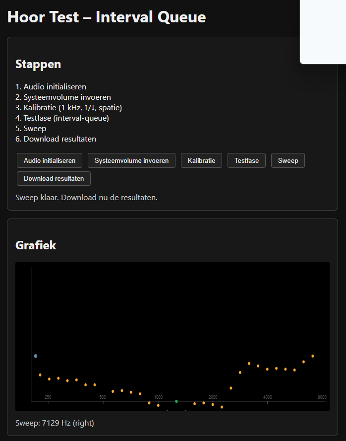

# Hoor Test – Piano Frequencies

A browser-based single-page application for psychoacoustic hearing threshold measurements using piano-frequency sine tones, per-ear calibration, and an auto-switching test flow.



---

## Features

- **6-step workflow**: Audio → System Volume → Calibration → Test → Sweep → Download
- **Per-ear calibration** at 1 kHz
- **Piano frequency range**: 110 Hz – 4186 Hz (A2–C8)
- **Real-time chart** showing thresholds in dB re: calibration gain
- **Continuous sweep** playback of threshold results
- **JSON export/import** with timestamp, OS info, and all measurements
- **Keyboard & mouse** controls — no mouse needed for the main flow
- **Zero dependencies** — runs in any modern browser

## How to Use

### 1. Audio

Audio initializes automatically on page load. The button shows ✓ (ready), ⏳ (pending), or ✗ (error).

### 2. System Volume (optional)

Enter your system volume level (0–100). This is stored in the results but does not affect the app's output — it helps you remember the listening level for repeat tests.

### 3. Calibration

Calibrate each ear independently at 1 kHz:

- **↑ / ↓** — adjust gain until you can just hear the tone
- **E** — switch between left and right ear
- **Space** — confirm calibration for the current ear

Repeat for the other ear.

### 4. Test Phase

Navigate through piano notes and mark your hearing threshold for each note:

- **→ / ←** — next / previous piano note
- **Space** — mark threshold for the current ear (auto-switches to the other ear)
- Once both ears are done for a note, the app advances to the next note

### 5. Sweep

Plays a continuous smooth frequency sweep through both ears' threshold points:

- Left ear all points → right ear all points → loops until stopped
- Click the **Stop** button or the **Sweep** button again to stop

### 6. Download

Exports a JSON file containing:

- Timestamp and user agent
- System volume
- Per-ear calibration gains
- All threshold measurements (frequency, gain, normalized x-position)

### Uploading Previous Results

Drag-and-drop a `.json` results file onto the page, or use the **Upload resultaten** button to restore previous data for viewing.

### Keyboard Shortcuts

| Key         | Action                                 |
| ----------- | -------------------------------------- |
| `↑` / `↓`   | Adjust gain during calibration         |
| `→` / `←`   | Next / previous piano note during test |
| `Space`     | Confirm calibration / mark threshold   |
| `E`         | Switch ear                             |
| Mouse wheel | Adjust volume / gain                   |

---

## For Developers

### Tech Stack

| Layer         | Technology                                                       |
| ------------- | ---------------------------------------------------------------- |
| Runtime       | Browser, vanilla JS                                              |
| Module system | Native ES Modules (`type="module"`)                              |
| Audio         | Web Audio API (`OscillatorNode`, `GainNode`, `StereoPannerNode`) |
| State         | Custom observable store (`getState` / `setState` / `subscribe`)  |
| UI            | Canvas 2D API + DOM text updates                                 |
| Styling       | Plain CSS, dark theme                                            |
| Build         | None required — no npm, no bundler                               |

### Architecture

The app is split into 4 ES modules:

```
index.html  →  main.js  →  audio.js
                    ↓          ↑
              state.js    freq-gens.js
```

| Module         | Purpose                                                                               |
| -------------- | ------------------------------------------------------------------------------------- |
| `main.js`      | Entry point: constants, store creation, chart rendering, event handlers               |
| `audio.js`     | Audio engine + domain logic (calibration, test flow, sweep, download). No DOM access. |
| `freq-gens.js` | Frequency generators: log mapping, piano note sequence, generator wrappers            |
| `state.js`     | Observable store factory                                                              |

**Data flow**: User action → `main.js` event handler → `audio.js` function → `store.setState()` → subscriber calls `renderUI()` → DOM + chart update.

See [`ARCHITECTURE.md`](ARCHITECTURE.md) for the full architecture documentation, module diagrams, and detailed description of each module.

### Local Development

No dependencies required. Serve the directory with any static HTTP server:

```bash
# Using npx
npx serve .

# Using Deno
deno run --allow-net --allow-read jsr:@std/http/file-server .

# Using Python
python -m http.server
```

Then open `http://localhost:3000` (or the port shown) in Chrome, Firefox, or Edge.

> **Note**: Opening `index.html` directly via `file://` may not work because browsers block ES module imports from the file protocol.

### Project Structure

```
├── index.html          # HTML shell (Dutch UI)
├── styles.css          # Dark theme, button state classes
├── main.js             # Entry point: constants, store, chart, events
├── audio.js            # Audio engine + domain logic (no DOM)
├── freq-gens.js        # Frequency generators (log mapping, piano notes)
├── state.js            # Observable store factory
├── favicon.svg         # Tab icon
├── ARCHITECTURE.md     # Detailed architecture docs
├── TODO.md             # Progress tracking & deployment options
├── AGENTS.md           # AI agent instructions
├── images/             # Screenshots and icons
└── CHAT.md             # Design conversation history
```

### Deployment

Native ES modules work over HTTPS. The simplest deployment is pushing as-is to **GitHub Pages**.

Optional bundling for production:

| Tool                 | Command                                                                                                                                                                                |
| -------------------- | -------------------------------------------------------------------------------------------------------------------------------------------------------------------------------------- |
| esbuild              | `npx esbuild main.js --bundle --format=esm --outfile=docs/bundle.js --minify`                                                                                                          |
| deno bundle          | `deno bundle main.js > bundle.js`                                                                                                                                                      |
| esbuild + obfuscator | `npx esbuild main.js --bundle --format=esm --outfile=docs/bundle.js && npx javascript-obfuscator docs/bundle.js --output docs/bundle.js --compact true --control-flow-flattening true` |

### Known Issues

- **No persistence**: Results live in memory until manually downloaded or re-uploaded
- **No cancellation**: Test flow cannot be interrupted mid-sequence
- **No retest**: After completion, recalibration is needed to test again
- **`setFreqFromX`** is exported but unused (frequency is set via `startOsc` in `playCurrentNote`)

### License

MIT — use freely, modify, share.
